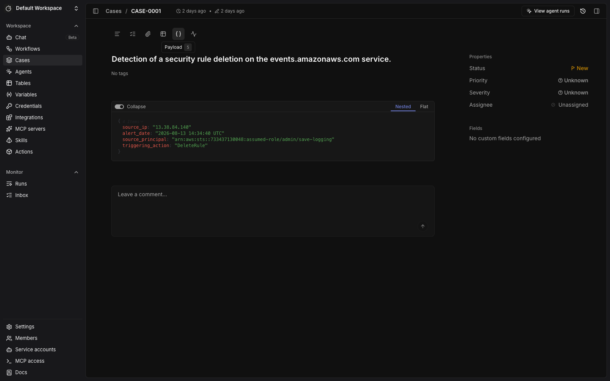
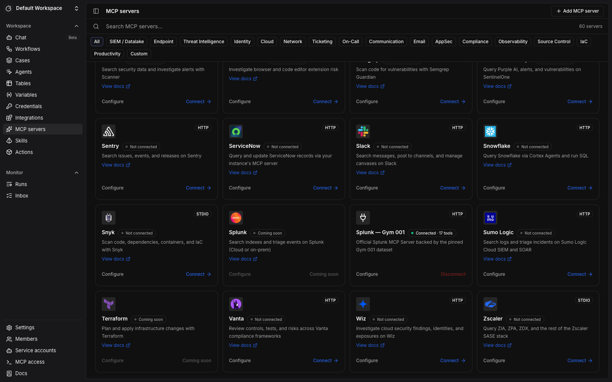

# Gym 001 — The Bigger Interview

An isolated, image-based Tracecat and Splunk Enterprise environment for the
[The Bigger Interview dataset](https://github.com/Kerberosse/soc-dataset-thebiggerinterview).
Tracecat is the pinned upstream production Compose stack; a Compose override
adds Gym 001 without modifying that snapshot.

## Start or migrate

Install the one-time host prerequisites:

```bash
brew install git-lfs just
git lfs install
git submodule update --init --recursive
```

An existing pre-001 stack must be migrated once so its OpenAI credential,
sessions, users, indexed events, and all other service state survive:

```bash
cd /Users/chris/repos/gyms/001
just migrate
```

For a fresh checkout:

```bash
SPLUNK_ACCEPT_TERMS=yes just up
just info
just status
just wait
```

`just down` keeps all volumes. Only `just reset CONFIRM=artifacts-captured` removes the new
Gym 001 volumes; it never removes legacy rollback volumes. The generated `.env`
is mode `0600`, is ignored by Git, and is never replaced silently.

## Evaluation

```bash
just eval
just eval RUNS=2
```

The default executes one independent, case-scoped investigation; `RUNS`
explicitly requests additional independent runs. Investigator sessions are
retained, and gitignored reports are stored in `eval-results/`. Reconciliation
creates the published alert as a native Tracecat case and the published
scorecard as a separate, unlinked `validation_gates` table. Only the tool-free
grader reads that table; the investigator receives the case and the Splunk MCP
integration. Before each evaluation, the harness verifies that integration's
pinned internal URI, HTTP/auth types, live connection, exact locked tool set,
and approval-free read policy. The source declaration is a Tracecat-maintained
transcription of the benchmark authors' public article—not an evaluator
distributed by the dataset repository. Each completed investigation report is
also appended to the alert case as a native comment. See
[`benchmark/README.md`](./benchmark/README.md) and [`PROVENANCE.md`](./PROVENANCE.md).

After preserving any useful session links and files, `just reset-evals
CONFIRM=artifacts-captured` replaces only the managed alert case and its
case-scoped chats, and removes any gym-titled grader session left by interrupted
cleanup. It retains the validation table, Splunk data, integration, presets,
credentials, and `eval-results/`.

## Restart or rebuild

`just restart` restarts Gym 001 while preserving its volumes, credentials,
cases, tables, and evaluation results. For a clean environment:

```bash
just clean-restart CONFIRM=artifacts-captured
```

The clean restart recreates only Gym 001 service volumes and then performs the
normal seed and reconciliation flow. Gitignored `eval-results/` remains on the
host. It does not act on any other gym directory.

## Images and auditing

`just up` calculates deterministic input hashes and selectively builds:

- `tracecat-gyms/gym-001-splunk:<input-hash>` (amd64, including compressed telemetry and MCP app)
- `tracecat-gyms/gym-001-control:<input-hash>` (native architecture, including `gymctl`, presets, and benchmark)

The only host bind mounts in the merged application are the rotating Splunk
license and evaluation result directory. Shared Tracecat source and image pins
live in `../platform.lock.json`; gym-specific artifacts, expected counts, and
the Splunk pin live in [`gym.lock.json`](./gym.lock.json).

Run `just check` for repository integrity and read-only validation against the
already-running stack. It never starts or resets services. `just
check-upstreams` performs the fail-closed online release and registry check.

The Splunk license expires at **2026-11-10T07:59:59Z**. Rotate it with:

```bash
just rotate-license FILE=/absolute/path/to/Splunk.License
```

## Demo walkthrough

Enable dark mode and use a 1600 × 1000 browser window for the same framing as
the reference images.
Gym 001 has its own Tracecat database, so configure its model even if another
gym is already configured. Start the stack first:

```sh
cd /Users/chris/repos/gyms/001
SPLUNK_ACCEPT_TERMS=yes just up
just wait
```

Open <http://127.0.0.1:18080/organization/settings/agent>, add the OpenAI
credential, and select `gpt-5.6-terra` as the organization default. Keep the key
out of shell history, README files, screenshots, and case comments. After the
provider shows as configured, run:

```sh
just reconcile
just status
just check
```

`just status` must report CASE-0001, the `validation_gates` table, the SOC
Analyst preset, the **Splunk — Gym 001** MCP integration, all 17 locked tools,
and the expected 2,236,985 indexed events.

### 1. Open The Bigger Interview alert

**Action:** Open <http://127.0.0.1:18080>, select **Cases**, open CASE-0001, and
select the **Payload** tab.

**Expected state:** The case contains the published cloud alert and its original
investigation context. The case is the entity to which the agent session and
final report will be attached.



**Presenter notes:** “This is a native Tracecat case backed by the fixed Bigger
Interview telemetry. The investigation begins from the alert; the validation
gates are kept separate so the investigator cannot read its answer key.”

### 2. Show the SOC Analyst preset

**Action:** Select **Agents** and open **Gym 001 SOC Analyst**.

**Expected state:** The managed SOC Analyst preset is visible with OpenAI
`gpt-5.6-terra` and **Splunk — Gym 001** attached. The separately managed
evaluation grader can also appear on this page; it has no investigation tools.

> Screenshot pending: capture `docs/screenshots/02-agents.png` after the Gym 001
> OpenAI provider is connected and reconciliation creates the preset.

**Presenter notes:** “The preset is reusable, but each evaluation creates a new
case-scoped session. Its evidence source is Splunk; the grading rubric is not
attached to the agent.”

### 3. Verify the Splunk MCP integration

**Action:** Select **MCP servers** and scroll to **Splunk — Gym 001**. Capture
the integration card showing **Connected · 17 tools**. For a live demo, select
**Configure** afterward to inspect the enabled tool list, but do not capture or
project credential fields.

**Expected state:** The integration card is connected and reports 17 tools.
Reconciliation has separately verified the pinned internal URI, HTTP
authentication shape, and the exact approval-free, read-only Splunk tool set.



**Presenter notes:** “The agent queries the same isolated Splunk instance every
time. Reconciliation validates the URI, auth shape, connection, exact tool set,
and approval-free read policy before an evaluation starts.”

### 4. Run and inspect a fresh investigation

**Action:** From the Gym 001 directory run exactly one evaluation:

```sh
just eval
```

When it finishes, open CASE-0001, click **View agent runs**, and select the newest
case-scoped SOC Analyst session. Expand one representative Splunk tool call,
then return to the completed response before capturing the screenshot so both
the evidence path and conclusion are legible.

**Expected state:** The session shows the analyst moving from the alert into
Splunk searches, pivots, and evidence-backed conclusions. Use only the actual
tool calls and outcome produced by this run in a demo.

> Screenshot pending: capture `docs/screenshots/04-investigation-run.png` from
> the fresh case-scoped evaluation described above.

**Presenter notes:** “The agent forms and tests hypotheses against fixed
telemetry. Point out the query sequence and the evidence returned, rather than
describing a predetermined conclusion.”

### 5. Review the report and validation gates

**Action:** Return to the case and show the latest investigation report comment
to establish that the completed response was delivered to the case. Then select
**Tables** → **validation_gates** and capture the table as the fifth screenshot.
Keep the newest `results.json` and `run-01/score.json` files in `eval-results/`
available if the audience asks for scoring details.

**Expected state:** The case contains the completed report from the same session.
The screenshot shows the separate benchmark-gate table; the latest artifacts
truthfully record which gates passed and failed for that run.

> Screenshot pending: capture `docs/screenshots/05-final-result.png` after the
> completed report and validation-gate results are available.

**Presenter notes:** “The report is delivered where an analyst works: on the
case. The validation gates remain separate during investigation and are applied
afterward. State the observed result exactly; do not turn a partial score into a
success claim.”

### Repeat the demo

After preserving the session link, screenshots, and evaluation JSON, replace
only the managed alert case and its case-scoped chats:

```sh
just reset-evals CONFIRM=artifacts-captured
just reconcile
just status
just check
```

Splunk data, the MCP integration, presets, credentials, validation table, and
host-side `eval-results/` remain. Use
`just clean-restart CONFIRM=artifacts-captured` only when you intend to recreate
all Gym 001 service volumes.
