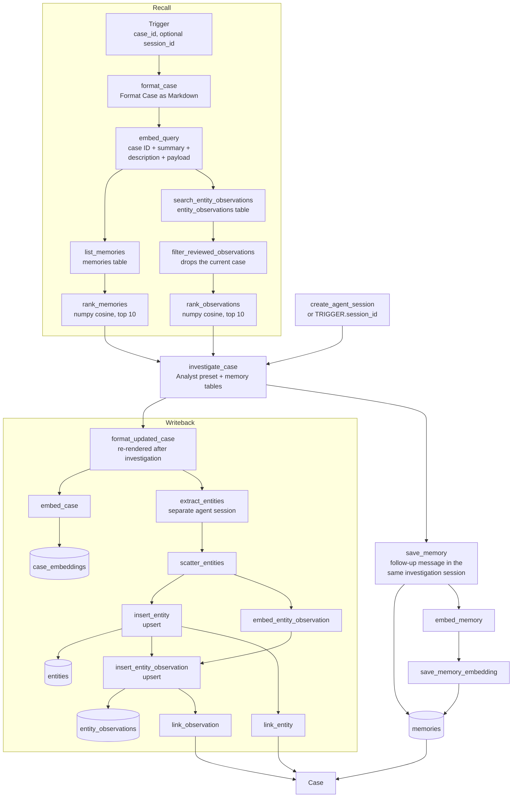
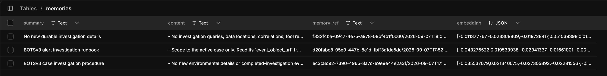
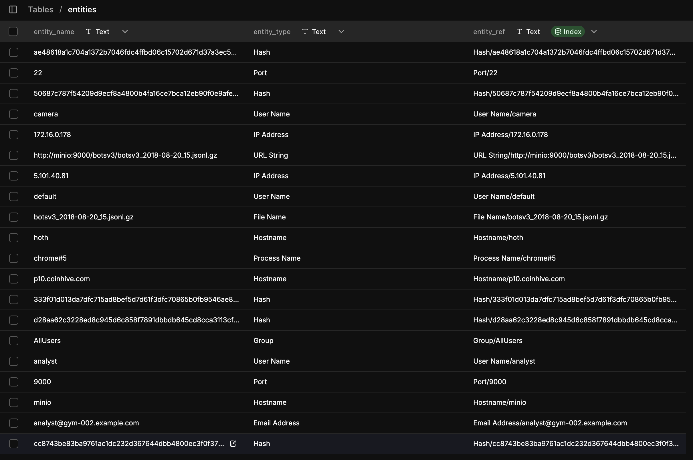
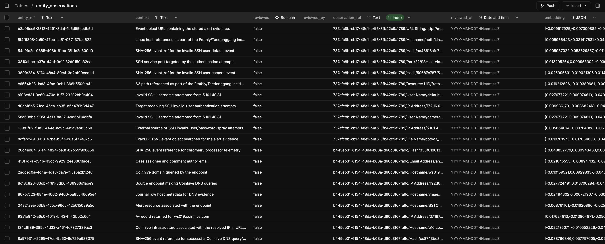
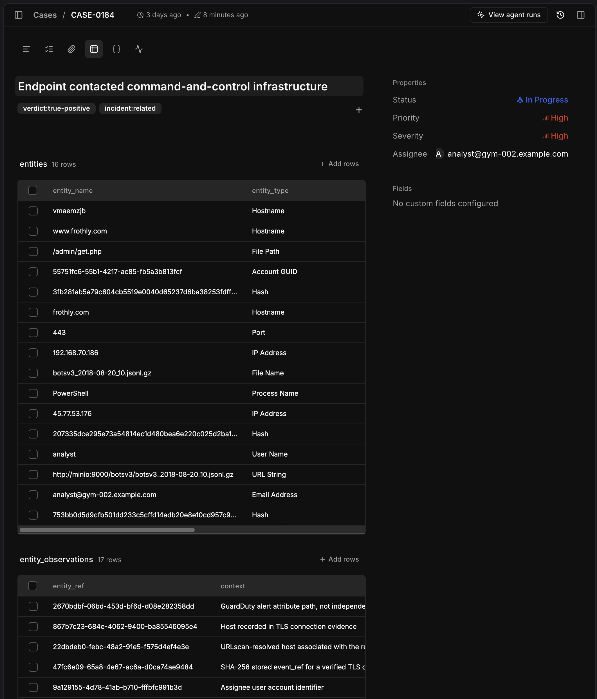
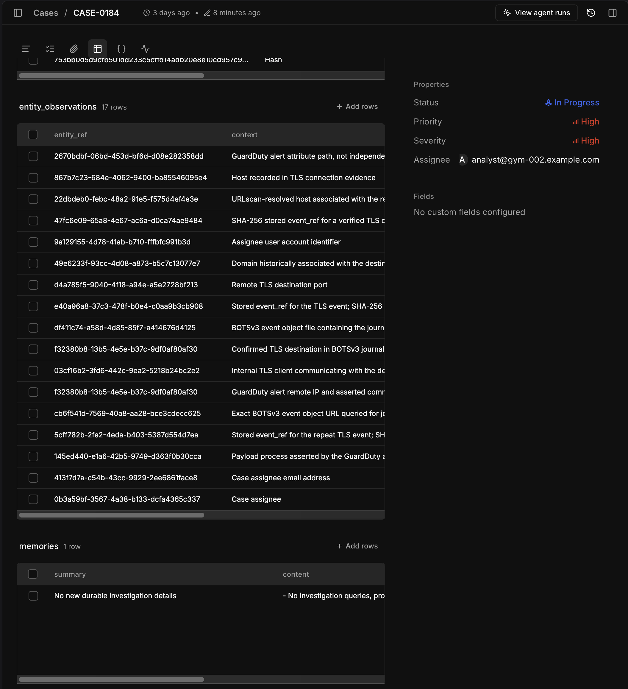
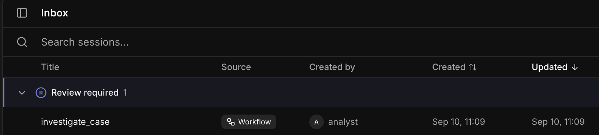
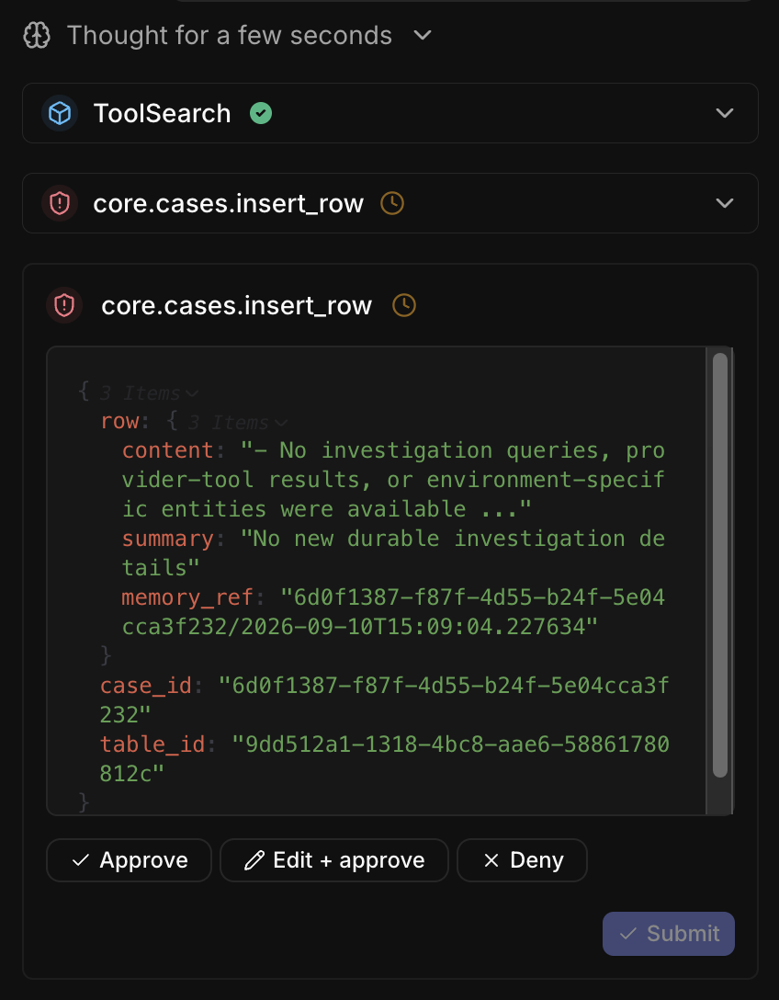

# Gym 002 — BOTSv3 analyst

Gym 002 is a local Tracecat Tier-1 SOC benchmark built from Splunk Boss of the
SOC v3. It presents 20 hand-audited provider alerts as native cases. Every case
points to the one hourly MinIO object containing its decisive evidence.

The analyst makes two independent decisions:

- determination: `true_positive` or `false_positive`
- incident relevance: `related` or `unrelated`

The managed `Investigate Case` workflow wraps those decisions in an agent memory
loop:

`case → semantic recall of memories and entity observations → investigation →
entity extraction → case-linked entities and observations → durable memory`

Each investigation reads what earlier investigations learned and writes back what
it learned itself. The walkthrough screenshots are illustrative examples from one
live run, not expected states.

## Agent memory architecture



Tracecat owns the case, the tables, the agent sessions, and every deterministic
insert and link. The only external dependency is the embedding endpoint.

### Recall

`format_case` calls the managed `Format Case as Markdown` child workflow. Only
the case ID, summary, description, and payload are embedded — not the whole
rendered case. That keeps the query vector small and focused on the details most
likely to match a related alert. If a deployment carries categorization data in
custom fields or dropdowns, add those to the query input; the goal is as much
real case context as possible.

The `format_case` call is a leftover from an earlier approach. Everything the
query embedding needs is the structured case, so this step can be reduced to a
plain case read. `format_updated_case` later in the workflow is the call that
actually needs the rendered Markdown, and it re-runs the same child workflow
after the investigation.

Every embedding is a plain `core.http_request` POST to OpenRouter using
`voyageai/voyage-4-lite` at 1024 dimensions. There is no mechanism to call an
embedding model through the Tracecat model catalog, so the key is resolved from
the `openrouter` workspace secret rather than from a configured provider. Any
embedding model works. The `dimensions` value must match on **all** embedding
steps — query, case, observation, and memory — or ranking fails on a vector
shape mismatch.

`filter_reviewed_observations` does not currently filter on review state. Its
lambda is `row["observation_ref"].split("/")[0] != case_id and (row["reviewed"]
or True)`, so it only excludes observations belonging to the case under
investigation. In a real deployment you would restrict this to `reviewed = True`
and implement a review process behind it. Observations are inserted and linked
deterministically later in the workflow, so there is no agent-based tool
approval on them — and there is no way to insert a human approval step inside the
workflow itself. Doing so would leave the workflow *running* until someone got
around to approving, and there can be many observations per case.

`rank_memories` and `rank_observations` are functionally the same numpy cosine
comparison against the stored vectors; only the output shape differs. Both return
the top 10 with no score restriction. The score is part of the returned shape, so
the agent can decide for itself whether a match is close enough to reference.
Pass `min_score` in the script inputs to enforce a floor instead. Both results are
rendered into the agent's prompt as Markdown tables.

### Investigation

The `investigate_case` user prompt is functionally the prompt the evaluator was
already using, plus two additions: a `<memory-context>` block and an
`<entity-observations>` block, each framed as recalled reference data rather than
new user input. It also carries the severity-conditional instruction to close
cases at medium priority *and* severity or below, and to assign
`analyst@gym-002.example.com` for anything above medium.

This is a place where just-in-time tool approval would be preferred — approve
closing cases at or below medium, require approval above it. As written, nothing
actually stops the agent from closing instead of escalating except the prompt.

The session ID is either passed in by the harness as part of `TRIGGER` or created
by the workflow at the top, so that the session maps to the user and carries the
case as its linked entity.

### Entity extraction

`extract_entities` runs in a new agent session with no linked entity, against the
Markdown-formatted case regenerated *after* the investigation — so it sees
comments, custom fields, and dropdowns written during the investigation. It is
given the entities already linked to the case and told not to return them again.

Entity types are based on the types allowed for OCSF observables, but not
strictly. There is a prompt instruction not to invent new types; it is not
enforced.

The `entities` table holds every entity discovered across all cases, which are
then linked to the cases they appear in. With linked-row-to-case lookups, an
agent could use this to quickly discover other cases involving the same entity.

`entity_observations` provide the case-specific context for what an entity's
involvement in a case actually is; that context is part of what entity extraction
returns. Observations are linked to the case as well. Note that both tables have
a column named `entity_ref` and they hold different things: on `entities` it is
the `<entity_type>/<entity_name>` natural key, while on `entity_observations` it
is the `entities` **row ID** returned by the upsert.

Only observations are embedded for future semantic search, because they carry the
entity details **plus** the relationship to the case. `entities` rows have no
embedding, and `case_embeddings` is written for future case-to-case similarity
but is not read back by this workflow.

The `entities` and `entity_observations` tables each have a unique index defined —
on `entity_ref` and `observation_ref` respectively — which is what makes the
`upsert: true` inserts work and keeps both tables deduplicated.

### Memory production

Memories are created as a follow-up message in the agent's *investigation*
session. That keeps the same investigative context — tool calling and everything
it observed — available to the memory production step. The agent's available
actions are overridden for that message to only `core.cases.insert_row`.

If HITL approval is desired, that is the action to gate. Again, just-in-time and
argument-based approval rules would help here: the agent should only ever write to
the `memories` table, and attempts to write to other tables should be rejected
outright. There are also values that should not be set at all by the agent
(`embedding`) or that should be set to a static value (`memory_ref`), which the
same approval logic could handle.

The agent is given any previous memories created for the case and told not to
repeat past memories, its own instructions, or memories from other cases. It has
explicit permission to produce **no** memory if nothing new is worth remembering.
It is given a static `memory_ref` value — `<case_id>/<ISO timestamp>` — so the
workflow can find the new row afterwards and write its embedding.

## Start

Requirements are Docker with Compose 2.24.4+, Git LFS, `just`, and Python 3.11+.

```bash
cd 002
git lfs install
just init
just up
just info
```

The Tracecat UI listens only on `http://127.0.0.1:28080`. If initial
reconciliation reports that no model is configured, configure a provider and
organization-default model in the UI, then run `just reconcile` and `just
wait`.

An OpenRouter API key is required. Set `OPENROUTER_API_KEY` in `.env` before
`just up` or `just reconcile`; reconcile publishes it into the `openrouter`
workspace secret, which the managed `Investigate Case` workflow resolves for its
embedding steps. Reconcile fails fast when the key is absent. To use a different
embeddings provider, change the embedding actions in
`benchmark/workflows/investigate-case.json` and update the secret name that
`reconcile.py` publishes. Change the `dimensions` value on every embedding action
together, and re-embed anything already stored.

Reconcile also manages the four case tables in `benchmark/tables/`, the
`Investigate Case` and `Format Case as Markdown` workflows in
`benchmark/workflows/`, and a `tracecat` secret holding the tenant analyst login
that the workflow uses when a trigger does not supply an agent session. Workflow
drift is detected by comparing the committed definition with the managed file, so
edits made in the UI must be exported back over
`benchmark/workflows/investigate-case.json` before reconcile will pass.

URLscan and VirusTotal remain benchmark requirements for five applicable cases.
Configure `URLSCAN_API_KEY` and `VIRUSTOTAL_API_KEY` directly in Tracecat when
available. Missing credentials do not block an investigation; their gates are
reported as missed.

## Evaluation

```bash
# All 20 cases, sequentially
just eval

# Drive the managed workflow instead of prompting the preset directly
just workflow-eval

# Re-score a completed evaluation after a scorer change, without re-running
# investigators; writes a sibling <eval-id>-rescore-<timestamp> directory
just rescore EVAL_ID=20260907T075632Z-4584b519

# One case
just eval ALERT_ID=guardduty:c2-contact
```

`just eval` prompts the investigator preset directly and exercises no memory.
`just workflow-eval` drives `Investigate Case`, so it is the only mode that
recalls prior memories and observations and writes new ones back. The harness
creates the agent session itself and hands the ID to the workflow, keeping session
identity and the workflow definition version under harness control.

Each selected case must be pristine. The investigator can access only that
case, its exact MinIO object, the seven local reasoning skills, case-update
actions, DuckDB, and read-only enrichments. Cross-case search is not enabled;
recalled memories and entity observations are the only cross-case signal, and
they arrive as prompt context rather than as a searchable tool.

MinIO records contain a stored, deterministic `event_ref`. The investigator
must select it directly, cite an audited anchor reference in the case, record
both decision tags, and close the case. The harness checks those mechanical
requirements deterministically. DuckDB evidence counts only when every query is
a single read-only query whose DuckDB-parsed result lineage reaches only the
case's literal `read_json_auto` URL. Unused CTEs and secondary relations do not
qualify. A tool-free grader evaluates only whether the cited evidence supports
both conclusions. There is no aggregate score.

Case sessions and gitignored artifacts under `eval-results/` are retained. Once
useful artifacts are captured, reset only Gym 002's managed cases and sessions:

```bash
just reset-evals CONFIRM=artifacts-captured
```

The command is interruption-safe and idempotent. It removes any remaining
`gym_id=002` cases and any gym-titled grader sessions left by interrupted
cleanup, then recreates the exact 20-case queue. Models, integration credentials,
skills, presets, service volumes, and host artifacts are retained.

Memory accumulates across evaluation runs. `entities`, `entity_observations`,
`memories`, and `case_embeddings` are not cleared by `just reset-evals`, so a
second `just workflow-eval` over the same 20 cases starts with everything the
first run learned. Clear those tables in the UI for a cold-memory baseline.

## Dataset and evidence boundary

The canonical Git LFS artifact is
`assets/botsv3-20260904T130332Z-1-001.zip`, locked by checksum. It contains 71
gzip JSONL members and 489,968 records. The ZIP enters only the `dataset-seed`
container through a read-only mount. Seeding adds a
`sha256-object-line-v1` reference to each immutable source record before upload;
the archive itself is never modified or copied into an image.

`benchmark/evals/cases.source.json` declares public alert fields, exact evidence objects
and predicates, and the two hidden truth axes. Regenerate the two committed
artifacts with:

```bash
just update-dataset
```

Generation fails unless every positive anchor resolves to exactly one source
row and every negative predicate resolves to none. `just check` reruns this
corpus audit in memory and byte-compares the generated files.

## Validation and cleanup

`just status` checks the exact live cases, skills, presets, and enrichment
credential status. `just check` additionally validates the archive, generated
contracts, Compose model, control image, seeded dataset, and live service
health. It does not destroy state.

```bash
just reset CONFIRM=artifacts-captured
just clean-restart CONFIRM=artifacts-captured
```

These full-cleanup commands remove only Gym 002 Compose state and never delete
host `eval-results/`. A clean restart also removes the Tracecat database, so UI
model and integration settings must be configured again — and it destroys the
accumulated memory tables.

## Memory walkthrough

The reference set covers the three memory stores, what one investigation linked
back to its case, and what gating the memory write looks like. All images use
dark mode.

**The screenshots are examples, not expected states.** Each was captured from one
run of one case in one workspace. Row counts, entity values, case numbers,
verdicts, memory text, and how much memory has accumulated all differ between
runs, between models, and between a cold workspace and one that has already been
through `just workflow-eval`. Nothing here is a fixture to diff against — the
harness gates in `benchmark/evals/` are the only deterministic checks in this gym.
Each step below separates the structure that holds on every run from the
run-specific detail visible in that particular capture.

Before presenting, start and reconcile the exercise, then drive at least one case
through the workflow so the tables are populated:

```bash
cd 002
just up
just wait
just reconcile
just status
just workflow-eval ALERT_ID=guardduty:c2-contact
```

`just status` must report 20 cases, the managed tables, the investigator preset,
and the seven skills. Do not place a key in a terminal, README, screenshot, or
case comment.

### 1. Show the three memory stores

**Action:** Open Tracecat at <http://127.0.0.1:28080>, select **Tables**, and open
`memories`, then `entities`, then `entity_observations`.

**What holds every run:** `memories` carries a `summary`, `content`, a
`memory_ref` of `<case_id>/<ISO timestamp>` supplied by the workflow, and an
`embedding` written back after the row is inserted. How many rows exist, and what
any of them say, depends entirely on what the agent decided was worth recording.

**In this capture:** three memories from earlier runs, one of them titled "No new
durable investigation details" — the agent has explicit permission to skip writing
a memory when nothing new is worth remembering, and it does not always take it.
Expect different titles, different counts, and possibly none at all.



**What holds every run:** `entities` is the cross-case store. `entity_ref` is
`<entity_type>/<entity_name>` and carries the unique index that makes the upsert
deduplicate. There is no embedding column.

**In this capture:** the OCSF-derived type labels that happened to appear —
`Hash`, `Port`, `User Name`, `IP Address`, `URL String`, `File Name`, `Hostname`,
`Process Name`, `Group`, `Email Address`. The enum in the extraction prompt is
much longer than this; which labels show up is a property of the cases run so far,
and the model is not prevented from emitting one that is not in the enum at all.



**What holds every run:** `entity_observations` holds the case-specific context
for an entity, keyed by an `observation_ref` of
`<case_id>/<entity_type>/<entity_name>/<context>` under its own unique index, with
`reviewed`, `reviewed_by`, `reviewed_at`, and the embedding. Every row is inserted
with `reviewed` hardcoded to `false`, and every row is eligible for recall
regardless, because the filter ignores the column.

**In this capture:** contexts like "Invalid SSH username attempted from
5.101.40.81" and "External source of SSH invalid-user/password-spray attempts".
The wording is model-generated and will not reproduce verbatim.



**Presenter notes:** "Entities are global and deduplicated; observations are what
that entity *did* in a specific case. Only observations get embedded, because only
they carry the relationship. The `reviewed` column is the hook for a review
process — right now the filter ignores it, so everything is recallable."

### 2. Show what one investigation linked back to its case

**Action:** Select **Cases**, open a case that has been through
`Investigate Case`, and select the linked-rows tab. Scroll through `entities`,
then `entity_observations`, then `memories`.

**What holds every run:** the case carries both decision tags, one from each axis
— `verdict:true-positive` or `verdict:false-positive`, and `incident:related` or
`incident:unrelated`. Severity routing applies: at medium priority *and* severity
or below the case is closed, above medium it is assigned to
`analyst@gym-002.example.com`. Whatever entities extraction found are linked as
first-class rows from the case's post-investigation Markdown.

**In this capture:** CASE-0184, tagged `verdict:true-positive` and
`incident:related`, High/High, and therefore **In Progress** and assigned rather
than closed. Which case number you get, which way the verdict falls, and whether
it escalates all depend on the case you run and how the model reads it.



**In this capture:** 16 linked entities, 17 linked observations, and one memory.
These counts are outputs of a single extraction pass, not a target.



**Presenter notes:** "Everything the agent learned is attached to the case as
first-class linked rows, not buried in a comment. In this run the case was High,
so it escalated instead of closing — that is the prompt's severity rule working,
not something the workflow enforces. Note also that extraction picked up the
assignee email and the MinIO object URL; entity types are guided by a prompt, not
enforced by a schema."

### 3. Gate the memory write

**Action:** Configure a tool approval on `core.cases.insert_row` for the
investigator preset, run a case through the workflow, and open the **Inbox**. This
is not the shipped configuration — `benchmark/agent/investigator-preset.json` sets
`tool_approvals` to `{}`, so the gate below has to be turned on deliberately.

**What holds every run:** with that approval configured, the `investigate_case`
session appears under **Review required**, sourced from the workflow and created
by the `analyst` tenant user, and the run blocks there until someone acts.



**What holds every run:** opening the session shows the pending
`core.cases.insert_row` call with its full arguments — the memory `row` with
`content`, `summary`, and the workflow-supplied `memory_ref`, plus the `case_id`
and the `memories` `table_id` — behind Approve / Edit + approve / Deny controls.

**In this capture:** the specific memory the agent proposed for that case. The
argument shape is fixed by the workflow; the `content` and `summary` are not.



**Presenter notes:** "This is the one agent write in the whole memory loop, and it
is the only one worth gating — entities and observations are inserted
deterministically by the workflow after extraction. What is missing is
argument-level approval: the reviewer should not have to read the arguments to
confirm the agent is writing to the `memories` table and not another one, or that
it did not try to set `embedding` itself. That belongs in a rule, not in a human's
attention."

### Repeat the walkthrough

Reset only the managed cases and sessions, keeping the memory tables so the next
run demonstrates recall:

```bash
just reset-evals CONFIRM=artifacts-captured
just reconcile
just status
```

For a cold-memory baseline, clear `memories`, `entities`, `entity_observations`,
and `case_embeddings` in the UI before rerunning, or use
`just clean-restart CONFIRM=artifacts-captured` to rebuild the whole workspace.

Review the case before presenting again and avoid displaying credentials,
cookies, extracted values, raw payloads, or secret-bearing logs.

See [`benchmark/README.md`](benchmark/README.md) and
[`PROVENANCE.md`](PROVENANCE.md) for source and evaluator boundaries.
