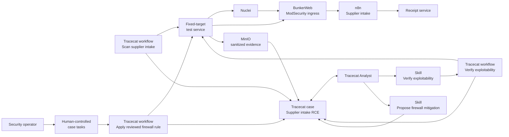
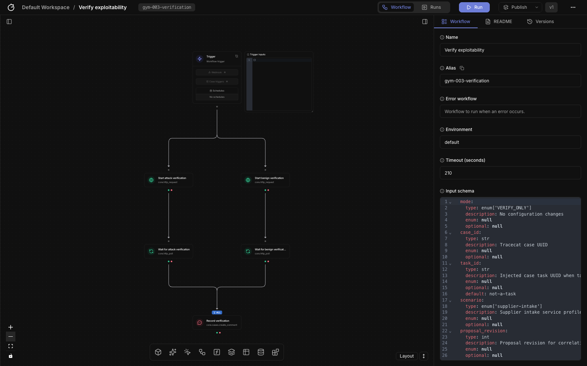

# Gym 003: vulnerability-driven firewall mitigation

Gym 003 is a reproducible, isolated exercise for this lifecycle:

`Nuclei suspicion → Tracecat case → Analyst verification → Analyst proposal → human-approved case task → BunkerWeb rule → Analyst review`

The fictional service accepts supplier documents, receives independent JSON
order updates, supports staff login, and exposes a health check. n8n 1.65.0 is
reachable only through BunkerWeb. A fixed-target test service runs the reviewed
checks and holds the firewall credential; the Analyst never receives that credential
or an arbitrary target, command, or rule-writing interface.

## Solution architecture



Nuclei supplies the initial version signal. Tracecat owns the case, Analyst,
skills, review tasks, and workflow evidence. The fixed-target test service keeps
the target and firewall credential outside the agent boundary. BunkerWeb applies
the reviewed ingress control, while n8n and the receipt service provide the
application and compatibility paths exercised by each verification.

## Supply-chain policy

All Compose images use immutable manifest digests. Image metadata comes from the
official publisher or Docker Official Image registry and is recorded in
`gym.lock.json` and `PROVENANCE.md`. An image may be downloaded only after a
seven-day cooldown. The repository's September 3 Tracecat images were already
present on this host; startup refuses to fetch them before their September 10
cooldown date. Python dependencies inherited from Tracecat are exact `==` pins;
Gym 003 adds no floating package requirement.

Run `just verify-supply-chain` to query the recorded official Docker Hub metadata
without pulling images. Review any digest or publication-date change before
updating the lock.

## Run the exercise

From this directory:

```sh
just init
just doctor
just up
just wait
```

Open Tracecat at <http://127.0.0.1:38080>. The protected application ingress is
<http://127.0.0.1:38081> with host name `supplier.intake.test`; n8n itself has no
published port.

Tracecat must have a provider and organization-default model before it can create
the Analyst preset. If the initial reconcile reports that no default model is
configured, set one in the Tracecat UI, then run `just reconcile` and `just wait`.

The reconciler creates one CVE-2026-21858 case, one Analyst preset, two published
Analyst skills, three published workflows, and three independently runnable case
tasks. The workflows appear as **Scan supplier intake**, **Verify
exploitability**, and **Apply reviewed firewall rule**.

- `Test exploitability` runs fresh attack and benign verification without a rule change.
- `Create LOG-only rule` installs the same predicate in observation mode, retests, and records correlated events.
- `Create BLOCK rule` snapshots configuration, installs the blocking predicate, confirms activation, retests attack and benign behavior, and rolls back on incomplete verification or regression.

Material case updates retain the rule/revision, workflow execution and test run references,
before/after verdicts, benign results, correlated WAF events, MinIO evidence links,
and rollback state. The Analyst posts concise assignment, finding, recommendation,
and closure updates rather than tool-level progress. A successful rule is described as mitigation at the tested
ingress; the vulnerable application version remains unchanged and the scanner can
continue to report it.

Run the complete active acceptance sequence explicitly:

```sh
just evaluate
```

It tests baseline, LOG_ONLY, BLOCK, removal/restoration, header casing,
content-type parameters, route normalization, target outage handling, malformed
and stale proposals, duplicate application, and failed reload rollback. This is
the only command intended to exercise the complete fixed exploit chain.

`just check` validates configuration and, when the stack is running, performs
non-destructive health checks. `just down` retains volumes and evidence.

## Reset and retained evidence

The active verifier creates only one temporary workflow and removes it. n8n is
configured not to persist webhook success/error payloads, preventing copied file
data from accumulating in its SQLite database. If cleanup cannot be confirmed,
it marks the scenario dirty and refuses another run.

After capturing artifacts, reset the target and managed firewall state with:

```sh
just scenario-reset CONFIRM=artifacts-captured
```

MinIO and job evidence remain. Full volume deletion uses
`just reset CONFIRM=artifacts-captured`; host-side `eval-results/` is retained.

## Baseline boundary

ModSecurity starts enabled with only the declared Gym 003 baseline configuration.
BunkerWeb bad-behavior bans and request-rate limits are disabled for deterministic
replay, and the reverse proxy forwards the editor methods needed for verified
cleanup.
The agent-visible scenario inventory is in `benchmark/scenario.json`. Expected
evaluation outcomes are kept separately under `benchmark/evals/`.

## Case walkthrough

Enable dark mode and use a 1600 × 1000 browser window for the same framing as
the reference images.
Before presenting, start and reconcile the gym:

```sh
cd /Users/chris/repos/gyms/003
just up
just wait
just reconcile
just status
just check
```

`just status` must report one case, three tasks, three managed workflows, one
preset, and two published skills. If Tracecat has no organization default, open
<http://127.0.0.1:38080/organization/settings/agent>, configure OpenAI, select
`gpt-5.6-terra`, and run the commands again. Do not place a key in a terminal,
README, screenshot, or case comment.

### 1. Establish the scanner finding

**Action:** Open <http://127.0.0.1:38080>, select **Cases**, and open
**CASE-0001 — Suspected unauthenticated n8n RCE on supplier intake**.

**Expected state:** The case is Critical/High. Its Markdown description presents
the Nuclei version signal in a compact evidence table and renders a Mermaid flow
from scanner suspicion through verification, proposal, human action, and retest.


**Presenter notes:** “The scanner starts the investigation, but a version match is
only a signal. The table defines the evidence and compatibility boundary; the
diagram previews the human-controlled path from finding to verified mitigation.”

### 2. Show the Analyst and its skills

**Action:** Select **Agents** in the workspace navigation.

**Expected state:** Exactly one preset named **Analyst** is visible, using OpenAI
`gpt-5.6-terra`. It has the published skills **Verify exploitability** and
**Propose firewall mitigation**. There is no separate verifier, mitigation
specialist, or investigation-wrapper agent.


**Presenter notes:** “One Analyst owns the investigation narrative. Its skills
constrain verification and proposal work to reviewed actions, and it has no
firewall-write permission. Applying a control remains a human decision.”

#### 2a. Inspect the Analyst prompt

**Action:** Open **Analyst** from the Agents list. Keep the main document pane at
the top so the Analyst name, description, and opening prompt instructions are
visible. The prompt is the large document pane; the tabs on the right configure
chat and capabilities.

**Expected state:** The prompt tells the Analyst to own the vulnerability case,
treat the scanner result as an initial signal, use fresh sanitized evidence, and
leave firewall changes to human-launched case tasks. The visible copy contains no
exercise label or specialist-agent handoff.


**Presenter notes:** “The preset carries the durable operating contract. One
Analyst follows the case from assignment through closure, but the prompt keeps
claims evidence-based and keeps firewall execution behind a human task.”

#### 2b. Inspect the Analyst tools

**Action:** With **Analyst** still open, select the **Tools** tab in the right
pane. Scroll until **Allowed tools** and the configured approval rows are visible.

**Expected state:** The allowed set contains case read/comment operations and
`core.workflow.execute`. No firewall, credential, shell, HTTP, or arbitrary code
tool is present. The workflow tool exists only so the published verification
skill can launch the fixed verification workflow. The scan and firewall workflows
have no agent-callable alias and remain available to their operator-controlled
entry points.


**Presenter notes:** “The Analyst can gather case context, write accountable
updates, and request one reviewed verification. The tool boundary itself offers
no path to author or apply a firewall rule.”

#### 2c. Inspect the published skills

**Action:** Select **Skills** in the workspace navigation and capture the list.
Then open `verify-exploitability`, select **SKILL.md**, and capture the published
frontmatter and the start of **Instructions**. Return to the list, open
`propose-firewall-mitigation`, select **SKILL.md**, and capture the same detail.

**Expected state:** The list shows exactly the two case skills as published. The
**Verify exploitability** detail limits execution to one fresh fixed-target run,
matched execution evidence, cleanup, and sanitized reporting. The **Propose
firewall mitigation** detail fixes the route, method, media type, compatibility
checks, rollback conditions, and human decision boundary.


**Presenter notes:** “Skills separate reusable procedures from the Analyst’s
identity. Verification is bounded and evidence-producing; mitigation design is
narrow and reviewable. Neither skill gives the model a credential or a free-form
rule interface.”

#### 2d. Inspect the customized workflows

**Action:** Select **Workflows**, open **Verify exploitability**, and frame the
complete builder graph. Keep action-detail drawers closed so only the workflow
structure and safe action names are visible. Repeat for **Apply reviewed firewall
rule**.

**Expected state:** **Verify exploitability** shows the trigger followed by the
attack and benign verification jobs, bounded waits, and the case evidence action.
**Apply reviewed firewall rule** shows the reviewed rule job, bounded wait, and
case result action. Both are published workflows. Neither screenshot exposes a
credential, internal endpoint, raw request body, or exploit material.




**Presenter notes:** “These are ordinary Tracecat workflows assembled from
reviewable actions. The verification workflow records attack and compatibility
evidence. The firewall workflow performs the stateful change and posts the result
for the Analyst to interpret, while its credential stays in the fixed service.”

### 3. Verify exploitability from the case

**Action:** Return to CASE-0001, click **Toggle Chat**, start a new case chat,
select **Analyst**, and send this prompt, replacing
`<case_uuid>` with the UUID in the case URL:

```text
Take ownership of this case. Validate whether the scanner finding has real impact at the exposed supplier intake ingress. Use the available exploitability verification skill for case_id=<case_uuid>. Record only material assignment and finding updates as concise Analyst comments with sanitized evidence.
```

**Expected state:** The Analyst first posts: “I’m validating whether this scanner
finding has real impact at the exposed ingress.” It invokes **Verify
exploitability** exactly once. The workflow records `confirmed_rce`, required
traffic success, and completed cleanup as system-generated evidence. The Analyst
then posts: “I confirmed unauthenticated command execution through the supplier
intake route.” Its durable finding includes separate `Status`, `Malice`,
`Action`, and `Context` values, what was found, what it means, and the next
decision without copying raw exploit material.


**Presenter notes:** “The same Analyst stays accountable from assignment through
closure. A harmless marker proves impact, raw exploit material is never written
to the case, and the temporary target workflow is removed.”

### 4. Produce a proposal without changing the WAF

**Action:** Continue with **Analyst** in the same case chat and send:

```text
Review the confirmed finding and use the firewall-mitigation proposal skill. Propose the narrowest compatible ingress control, record a decision-ready recommendation on the case, and identify the human approval required before any firewall change. Do not execute a firewall workflow.
```

Then click the case’s **0/3** task control.

**Expected state:** The Analyst uses **Propose firewall mitigation** to produce a
structured route/content-type proposal. It posts: “I recommend a route-scoped
content-type control. I need approval before applying it.” The comment explains
the demonstrated impact, blast radius, compatibility checks, rollback path, and
the decision required. The three human-controlled tasks are **Create BLOCK rule**,
**Create LOG-only rule**, and **Test exploitability**.


**Presenter notes:** “The analyst narrows the policy to the demonstrated route,
method, and normalized media type. It explains compatibility and rollback, then
stops. A person chooses whether to observe, block, or retest.”

### 5. Apply BLOCK and ask the Analyst to review it

**Action:** In the task list, select **Create BLOCK rule**, click **Apply reviewed
firewall rule**, choose `BLOCK`, keep the case-populated values, and click
**Trigger**. Wait for the run to complete, then return to the case chat and ask
**Analyst** to review the task result and close the investigation narrative. For
the complete acceptance run, execute:

```sh
just evaluate
```

**Expected state:** The workflow records `confirmed_rce` before the rule,
`blocked_by_waf` after it, required benign transactions as passed,
audit-correlated WAF events, no rollback, and `mitigated at tested ingress` in a
sanitized **Firewall change verification** result. The Analyst reviews that
evidence and posts: “I verified that the control blocks the tested attack while
required application traffic still succeeds.” Its closure update includes the
decision, reasoning, activity timeline, blast radius, and retained evidence; it
also states that the underlying application still requires remediation.
`just evaluate` writes its JSON result beneath
`eval-results/supplier-intake/acceptance/` and restores the managed WAF state.


**Presenter notes:** “The workflow supplies the technical evidence and the Analyst
turns it into a decision-grade closure. The control is active, the tested attack
is denied, independent JSON, receipt, login, health, and upload traffic still
work, and correlated evidence is retained. The application is still vulnerable;
the claim is mitigation at this ingress.”

### Repeat the walkthrough

After preserving the screenshots and run references, restore the target and WAF
without deleting retained evidence:

```sh
just scenario-reset CONFIRM=artifacts-captured
just reconcile
just status
just check
```

Use `just reset CONFIRM=artifacts-captured` only when you intend to delete the
Gym 003 volumes. Review the case before presenting again and avoid displaying
credentials, cookies, extracted values, raw payloads, or secret-bearing logs.
