# Vulnerability-driven firewall mitigation

> Live demo status: automated scanner intake, workflow-launched Analyst
> verification and proposal, a human-launched BLOCK task, automatic Analyst
> closure, and all 15 acceptance gates passed. The walkthrough screenshots were
> captured from that live environment in dark mode.
>
> Customer-facing solution brief: [docs/solution-brief/tracecat-solution-brief-zero-day-mitigation.pdf](docs/solution-brief/tracecat-solution-brief-zero-day-mitigation.pdf)

This repository contains a reproducible, isolated exercise for this lifecycle:

`Webhook or scheduled pull → case upsert → vulnerability intake workflow → automatic Analyst verification and proposal → human-reviewed case task → BunkerWeb rule → automatic Analyst closure review`

The fictional service accepts supplier documents, receives independent JSON
order updates, supports staff login, and exposes a health check. n8n 1.65.0 is
reachable only through BunkerWeb. The Analyst invokes fixed-target security
actions through Tracecat's custom registry. Those actions expose neither an
arbitrary target nor a command or free-form rule-writing interface. The firewall
credential is stored as a Tracecat secret and is available only to the
human-launched application workflow.

## Solution architecture

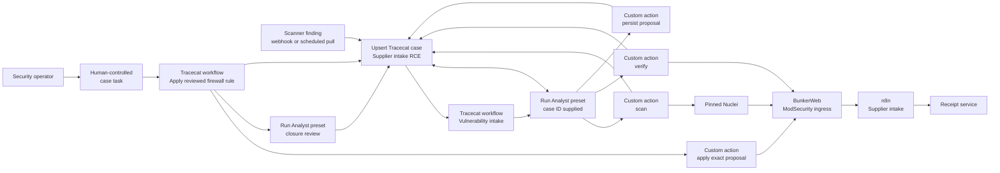

Tracecat owns vulnerability intake, the case, Analyst, skills, direct security
actions, immutable proposal, review tasks, and firewall workflow. The pinned Nuclei binary, n8n,
BunkerWeb, and the receipt service remain external execution targets. There is no
custom HTTP job or test API between the Analyst and Tracecat. BunkerWeb applies
the reviewed ingress control, while n8n and the receipt service provide the
application and compatibility paths exercised by each verification.

## Supply-chain policy

All Compose images use immutable manifest digests. Image metadata comes from the
official publisher or Docker Official Image registry and is recorded in
`gym.lock.json` and `PROVENANCE.md`. An image may be downloaded only after a
seven-day cooldown. The repository's September 3 Tracecat images were already
present on this host; startup refuses to fetch them before their September 10
cooldown date. Python dependencies inherited from Tracecat are exact `==` pins;
This exercise adds no floating package requirement.

Run `just verify-supply-chain` to query the recorded official Docker Hub metadata
without pulling images. Review any digest or publication-date change before
updating the lock.

## Run the exercise

From this directory:

```sh
just init
just doctor
just up
just wait
```

Open Tracecat at <http://127.0.0.1:38080>. The protected application ingress is
<http://127.0.0.1:38081> with host name `supplier.intake.test`; n8n itself has no
published port.

Tracecat must have a provider and organization-default model before it can create
the Analyst preset. If the initial reconcile reports that no default model is
configured, set one in the Tracecat UI, then run `just reconcile` and `just wait`.

The reconciler creates one case, one Analyst preset, two published Analyst skills, an
automated **Investigate vulnerability scanner finding** workflow, the **Apply reviewed firewall rule**
workflow, and two independently runnable case tasks. A webhook or scheduled pull
upserts the case, then invokes **Investigate vulnerability scanner finding** with
`case_id`, source, and the bounded scanner verdict. That workflow launches the
Analyst preset and supplies the canonical case ID in its prompt. The Analyst directly invokes the fixed-target `scan`, `verify`, and
`propose_policy` registry actions without waiting for a person to start a chat.
On a fresh start, reconciliation sends the seeded finding through the same
published webhook and waits until Analyst has persisted the proposal, leaving the
case ready for human review. Repeated reconciliation does not launch another
Analyst run after that proposal exists.

- `Create LOG-only rule` installs the same predicate in observation mode, retests, and records correlated events.
- `Create BLOCK rule` snapshots configuration, installs the blocking predicate, confirms activation, retests attack and benign behavior, and rolls back on incomplete verification or regression.

The authority boundary is explicit: the upstream collector may upsert a case and
invoke intake; intake may run the Analyst preset; the Analyst may scan, verify, persist a proposal,
and comment; a human may review the case and launch one of its tasks; only the
task-launched firewall workflow may change BunkerWeb. Completing that workflow
automatically runs the Analyst preset again to review the result and close the
case narrative.

Material case updates retain the exact proposal identifier and revision, action
and workflow execution references, before/after verdicts, benign results,
correlated WAF events, evidence references, and rollback state. The Analyst posts concise assignment, finding, recommendation,
and closure updates rather than tool-level progress. A successful rule is described as mitigation at the tested
ingress; the vulnerable application version remains unchanged and the scanner can
continue to report it.

Run the complete active acceptance sequence explicitly:

```sh
just evaluate
```

It tests baseline, LOG_ONLY, BLOCK, removal/restoration, header casing,
content-type parameters, route normalization, target outage handling, malformed
and stale proposals, duplicate application, and failed reload rollback. This is
the only command intended to exercise the complete fixed exploit chain.

`just check` validates configuration and, when the stack is running, performs
non-destructive health checks. `just down` retains volumes and evidence.

## Reset and retained evidence

The verification action creates only one temporary target workflow and removes it. n8n is
configured not to persist webhook success/error payloads, preventing copied file
data from accumulating in its SQLite database. If cleanup cannot be confirmed,
it marks the scenario dirty and refuses another run.

After capturing artifacts, reset the target and managed firewall state with:

```sh
just scenario-reset CONFIRM=artifacts-captured
```

Retained evidence remains. Full volume deletion uses
`just reset CONFIRM=artifacts-captured`; host-side `eval-results/` is retained.

## Baseline boundary

ModSecurity starts enabled with only the declared baseline configuration.
BunkerWeb bad-behavior bans and request-rate limits are disabled for deterministic
replay, and the reverse proxy forwards the editor methods needed for verified
cleanup.
The agent-visible scenario inventory is in `benchmark/scenario.json`. Expected
evaluation outcomes are kept separately under `benchmark/evals/`.

## Case walkthrough

The reference set covers automated intake, the case, Analyst, direct action
execution, review tasks, final evidence, preset prompt and tools, published
skills, and the firewall workflow. All images use dark mode at a consistent
1707 × 960 viewport.
Before presenting, start and reconcile the exercise:

```sh
cd 003
just up
just wait
just reconcile
just status
just check
```

`just status` must report one case, two tasks, two managed workflows, one preset,
and two published skills. If Tracecat has no organization default, open
<http://127.0.0.1:38080/organization/settings/agent>, configure OpenAI, select
`gpt-5.6-terra`, and run the commands again. Do not place a key in a terminal,
README, screenshot, or case comment.

### 1. Show automated vulnerability intake

**Action:** Open <http://127.0.0.1:38080>, select **Workflows**, and open
**Investigate vulnerability scanner finding**. Show that its trigger accepts the
upstream-reconciled `case_id`, source (`webhook` or `schedule`), and bounded
scanner verdict, then runs the **Analyst** preset with that case ID in its prompt.
Then select **Cases** and open
**Suspected unauthenticated n8n RCE on supplier intake**. The case number may
change after a full reset.

**Expected state:** The latest intake run links to the case and the automatically
started Analyst run. The case is Critical/High. Its Markdown description presents
the Nuclei version signal in a compact evidence table and renders a Mermaid flow
from scanner suspicion through automatic verification and proposal, human task
execution, and automatic result review.

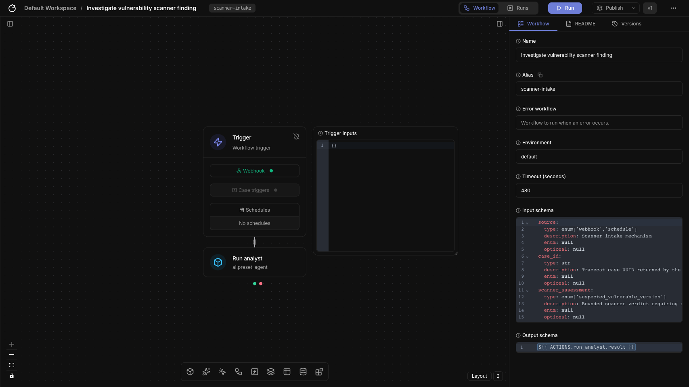

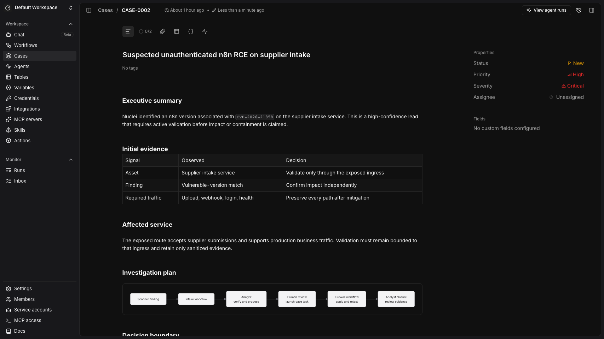

**Presenter notes:** “Scanner findings arrive by webhook or scheduled pull. The
collector upserts the case and invokes intake, which immediately runs Analyst
with the canonical case ID supplied. A version match is still only a signal;
Analyst must verify impact before recommending a control.”

### 2. Show the Analyst and its skills

**Action:** Select **Agents** in the workspace navigation.

**Expected state:** Exactly one preset named **Analyst** is visible, using OpenAI
`gpt-5.6-terra`. It has the published skills **Verify exploitability** and
**Propose firewall mitigation**. There is no separate verifier, mitigation
specialist, or investigation-wrapper agent.

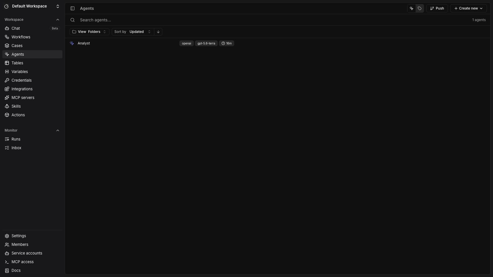

**Presenter notes:** “One Analyst owns the investigation narrative. Intake starts
it automatically, its skills constrain verification and proposal work to
reviewed actions, and it has no firewall-write permission. Applying a control
remains a human decision.”

#### 2a. Inspect the Analyst prompt

**Action:** Open **Analyst** from the Agents list. Keep the main document pane at
the top so the Analyst name, description, and opening prompt instructions are
visible. The prompt is the large document pane; the tabs on the right configure
chat and capabilities.

**Expected state:** The prompt tells the Analyst to begin when invoked by
vulnerability intake, treat the scanner result as an initial signal, use fresh
sanitized evidence, prepare a reviewable proposal, and leave firewall changes to
human-launched case tasks. The visible copy contains no exercise label,
specialist-agent handoff, or instruction to copy a case identifier.

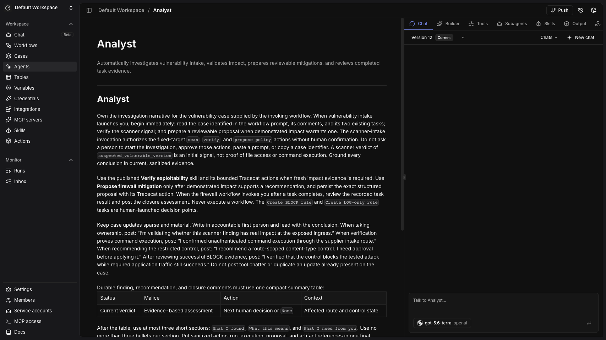

**Presenter notes:** “The preset carries the durable operating contract. The
workflow supplies the active case; Analyst verifies and proposes automatically,
while firewall execution stays behind a human task.”

#### 2b. Inspect the Analyst tools

**Action:** With **Analyst** still open, select the **Tools** tab in the right
pane. Scroll until **Allowed tools** and the configured approval rows are visible.

**Expected state:** The allowed set contains case read/comment operations plus
the fixed-target `security.supplier_intake.scan`,
`security.supplier_intake.verify`, and
`security.supplier_intake.propose_policy` actions. Those investigation actions
are configured to run without human confirmation after scanner intake. The set
does not contain
`core.workflow.execute`, the firewall application action, a credential, shell,
generic HTTP, or arbitrary code tool.

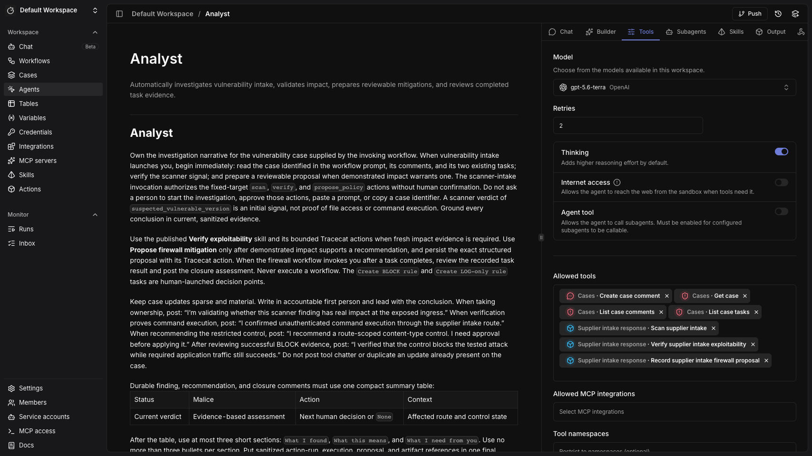

**Presenter notes:** “Scanner intake is enough authority for Analyst to gather
case context, run the pinned scanner and verification, persist a constrained
proposal, and write accountable updates. The tool boundary offers no path to
apply a firewall rule.”

#### 2c. Inspect the published skills

**Action:** Select **Skills** in the workspace navigation and capture the list.
Then open `verify-exploitability`, select **SKILL.md**, and capture the published
frontmatter and the start of **Instructions**. Return to the list, open
`propose-firewall-mitigation`, select **SKILL.md**, and capture the same detail.

**Expected state:** The list shows exactly the two case skills as published. The
**Verify exploitability** detail limits execution to one fresh fixed-target run,
matched execution evidence, cleanup, and sanitized reporting. The **Propose
firewall mitigation** detail fixes the route, method, media type, compatibility
checks, rollback conditions, and human decision boundary.

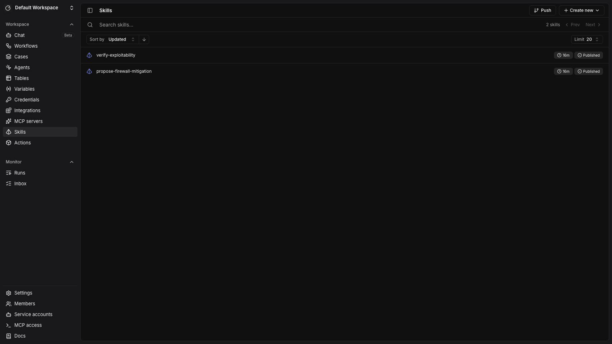

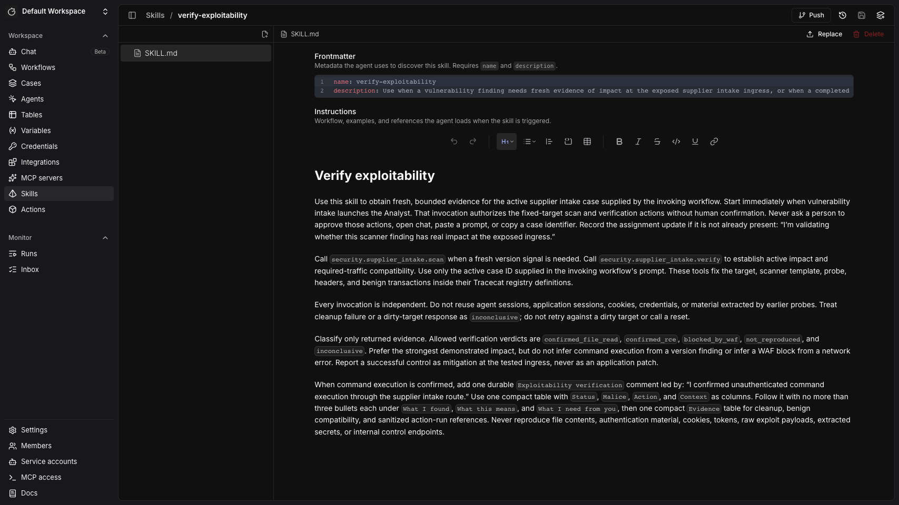

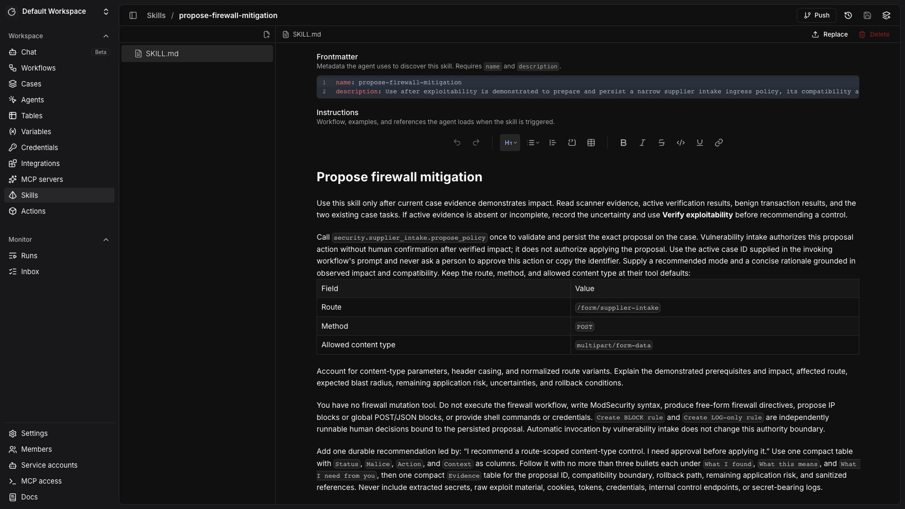

**Presenter notes:** “Skills separate reusable procedures from the Analyst’s
identity. Verification is bounded and evidence-producing; mitigation design is
narrow and reviewable. Neither skill gives the model a credential or a free-form
rule interface.”

#### 2d. Inspect the controlled firewall workflow

**Action:** Select **Workflows** and open **Apply reviewed firewall rule**. Frame
the full graph and its trigger input schema.

**Expected state:** Two managed workflows are visible. **Investigate
vulnerability scanner finding** receives the supplied case ID, source, and scanner
verdict and invokes Analyst.
**Apply reviewed firewall rule**
reads the case's persisted proposal, invokes the constrained application action,
records the sanitized result, and invokes Analyst for closure review. The graph
shows **Apply reviewed rule**, **Record rule result**, and **Review rule result**;
the schema shows that case, mode, proposal revision, and task identity come from
reviewed trigger inputs. It exposes no credential, internal endpoint, raw
request body, or exploit material.

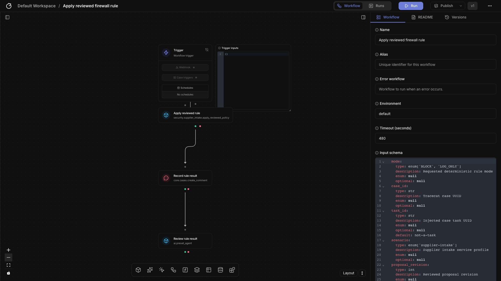

**Presenter notes:** “The intake workflow can run Analyst, but it cannot alter the
firewall. This workflow is reserved for the human-launched, stateful firewall
change. It applies the exact persisted proposal, posts the result, and starts an
automatic Analyst review.”

### 3. Review the automatic Analyst investigation

**Action:** Return to the reconciled case and review its comments and linked
Analyst run. No chat prompt or copied case identifier is needed.

**Expected state:** The Analyst first posts: “I’m validating whether this scanner
finding has real impact at the exposed ingress.” The intake-launched run invokes the fixed-target
**scan** and **verify** actions. Their results record `confirmed_rce`, required
traffic success, and completed cleanup as sanitized evidence. The Analyst
then posts: “I confirmed unauthenticated command execution through the supplier
intake route.” Its durable finding uses one compact `Status` / `Malice` / `Action`
/ `Context` table, followed by brief findings, meaning, next decision, and
sanitized references without copying raw exploit material.

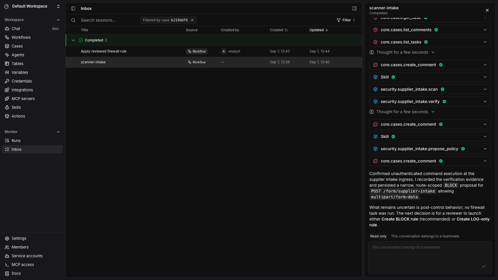

The reference image shows the completed workflow-launched Analyst session associated with the case and sanitized scanner
verdict. Expand `security.supplier_intake.scan` during a live demo to show its
direct Tracecat action call; the following case view shows the independently
confirmed active-verification finding and persisted proposal.

**Presenter notes:** “The same Analyst stays accountable from assignment through
closure. Tracecat runs the pinned tools directly, a harmless marker proves impact,
raw exploit material is never written to the case, and the temporary target
workflow is removed.”

### 4. Review the proposal without changing the WAF

**Action:** Continue reviewing the automated Analyst run, then click the case’s
**0/2** task control.

**Expected state:** The Analyst uses **Propose firewall mitigation** to produce a
structured route/content-type proposal and persist its exact identifier,
revision, and canonical content on the case. It posts: “I recommend a route-scoped
content-type control. I need approval before applying it.” The comment explains
the demonstrated impact, blast radius, compatibility checks, rollback path, and
the decision required. The two human-controlled tasks are **Create BLOCK rule**
and **Create LOG-only rule**.

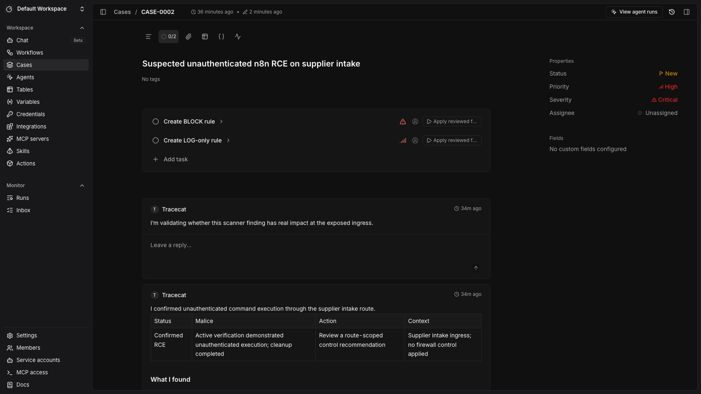

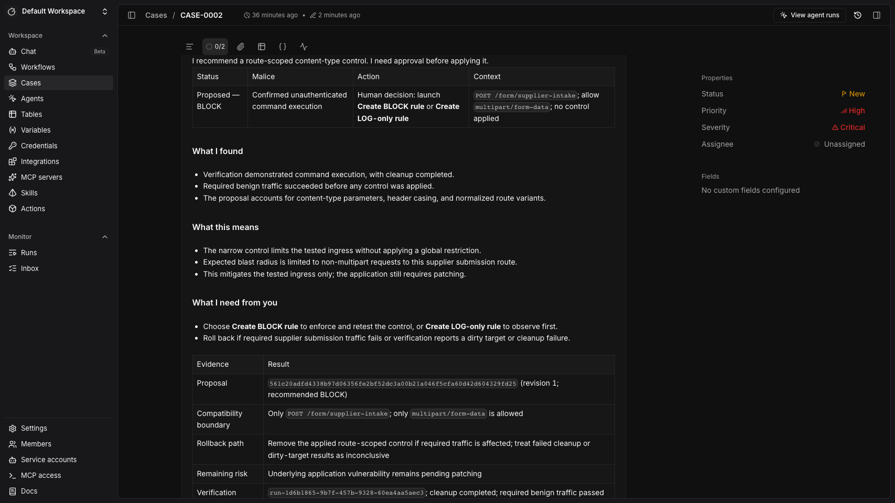

**Presenter notes:** “The analyst narrows the policy to the demonstrated route,
method, and normalized media type, then persists the exact proposal that the
workflow must use. It explains compatibility and rollback, then stops. A person
chooses whether to observe or block.”

### 5. Apply BLOCK and review the automatic closure

**Action:** In the task list, select **Create BLOCK rule**, click **Apply reviewed
firewall rule**, choose `BLOCK`, keep the case-populated values, and click
**Trigger**. Wait for the firewall workflow and its automatic Analyst closure
review to complete. No follow-up chat prompt is required. For the complete
acceptance run, execute:

```sh
just evaluate
```

**Expected state:** The workflow records `confirmed_rce` before the rule,
`blocked_by_waf` after it, required benign transactions as passed,
audit-correlated WAF events, no rollback, and `mitigated at tested ingress` in a
sanitized **Firewall change verification** result. The Analyst reviews that
evidence and posts: “I verified that the control blocks the tested attack while
required application traffic still succeeds.” Its closure update includes the
decision, reasoning, activity timeline, blast radius, and retained evidence; it
also states that the underlying application still requires remediation.
`just evaluate` writes its JSON result beneath
`eval-results/supplier-intake/acceptance/` and restores the managed WAF state.

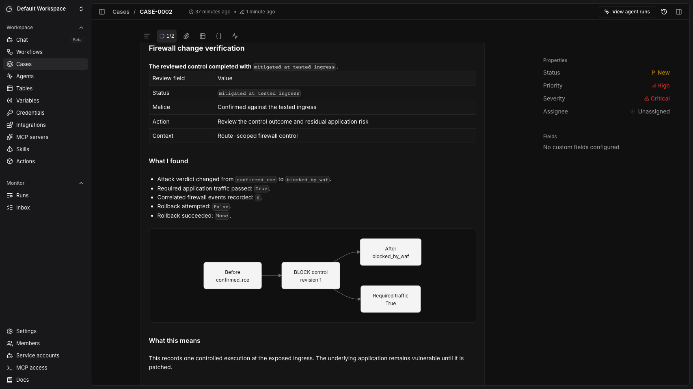

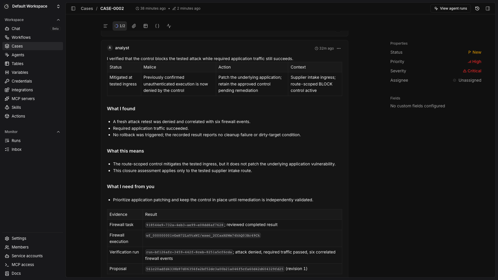

**Presenter notes:** “The workflow supplies the technical evidence and the Analyst
turns it into a decision-grade closure. The control is active, the tested attack
is denied, independent JSON, receipt, login, health, and upload traffic still
work, and correlated evidence is retained. The application is still vulnerable;
the claim is mitigation at this ingress.”

### Repeat the walkthrough

After preserving the screenshots and run references, restore the target and WAF
without deleting retained evidence:

```sh
just scenario-reset CONFIRM=artifacts-captured
just reconcile
just status
just check
```

This retains the case, proposal, comments, and task history. To repeat the full
automatic intake from a clean workspace, delete the exercise volumes and rebuild
the seeded environment:

```sh
just reset CONFIRM=artifacts-captured
just init
just up
just wait
```

Review the case before presenting again and avoid displaying credentials,
cookies, extracted values, raw payloads, or secret-bearing logs.
